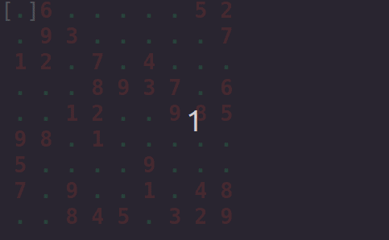
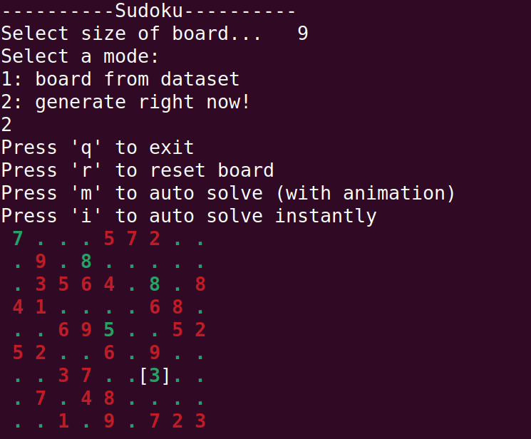

# sudoku
## Установка и запуск
1. git clone git@github.com:Mikhail-Sibiryakov/sudoku.git
2. cd sudoku
3. install.sh
4. run.sh
## Описание
Классическое судоку (в терминале Linux).\
Поле 4х4 или 9х9.\
Есть автоматическое решение.
## Пример работы

